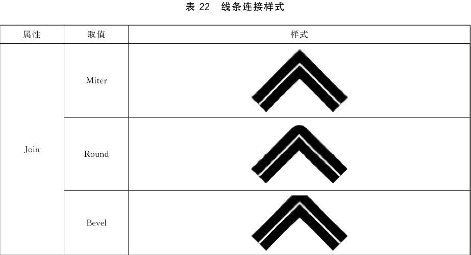
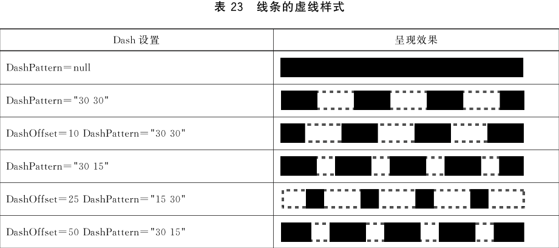
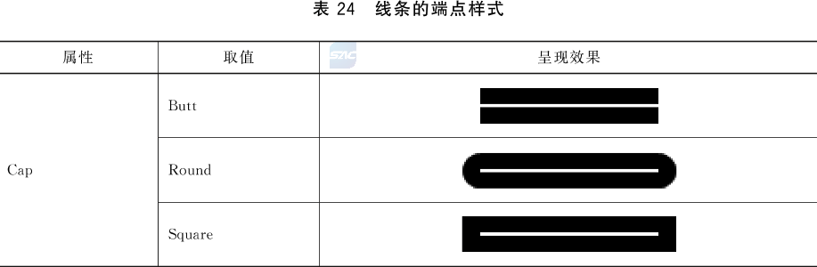
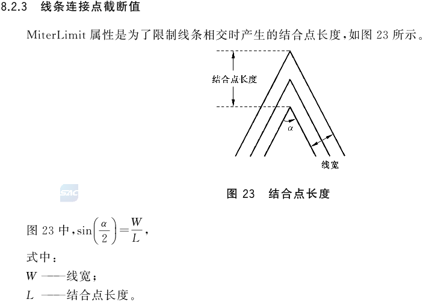

# Documents

## CommonData

文档公共数据，定义了页面区域、公共资源等数据

### MaxUnitID

当前文档中所有对象使用标识的最大值，初始值为0。MaxUnitID主要用于文档编辑，在向文档中新增加一个对象时，需要分配一个新的标识，新标识取值为 MaxUnitID + 1，同时需要修改此MaxUnitID值

### PageArea

指定该文档页面区域的默认大小和位置

#### PhysicalBox

必填 ST_Box 页面物理区域，左上角的坐标为页面空间坐标系的原点

#### ApplicationBox

选填 ST_Box 显示区域，页面内容实际显示或者打印输出的区域，位于页面物理区域内，包含页眉、页脚、版心等内容
[例外处理]如果显示区域不完全位于页面物理区域内，页面物理区域外的部分则会忽略。如果显示区域完全位于页面物理区域外，则该页面为空白

#### ContentBox

选填 ST_Box 版心区域，即文件的正文区域，位于显示区域内。左上角坐标决定了其在显示区域内的位置[例外处理] 如果版心区域不完全位于显示区域内，显示区域外的部分则被忽略。如果版心区域完全位于显示区域外，则版心内容不被绘制

#### BleedBox

选填 ST_Box 出血区域，即超出设备性能限制的额外出血区域，位于页面物理区域外。不出现时，默认值为页面物理区域[例外处理]如果出血区域不完全位于页面物理区域外，页面物理区域内部分则被忽略。如果出血区域完全位于页面物理区域内，则出血区域无效

### PublicRes

选填 ST_Loc 公共资源序列，每个节点指向OFD包内的一个资源描述文档，资源部分的描述见7.9，字型和颜色空间等宜在公共资源文件中描述

### DocumentRes

选填 ST_Loc 文档资源序列，每个节点指向OFD包内的一个资源描述文档，资源部分的描述见7.9，绘制参数、多媒体和矢量图像等宜在文档资源文件描述

#### BaseLoc

定义此资源文件的通用数据存储路径，BaseLoc属性的意义在于明确资源文件的位置，比如R1.xml中可以指定BaseLoc为“./Res”,表明该资源中所有数据文件的默认存储位置在当前路径的Res目录下

#### ColorSpaces

包含一组颜色空间的描述

##### ColorSpace

CT_ColorSpace 颜色空间描述，在基础类型上扩展定义ID属性，类型为ST_ID

#### DrawParams

包含一组绘制参数描述

##### DrawParam

CT_DrawParam 绘制参数描述，在基础类型上扩展定义ID属性，类型为ST_ID

###### Relative

可选 ST_RefID 基础绘制参数，引用在资源文件中绘制参数标识

###### Join

可选 xs:string 线条连接样式，指定了两个线的断点结合是采用的样式 默认值 Miter,线条连接样式的取值和显示效果关系表见 取值如下：

1. Miter
2. Round
3. Bevel

###### LineWidth

可选 xs:double 线宽，非负浮点数，指定了路径绘制时线的宽度。由于某些设备不能输出一个像素宽度的线，因此强制规定当线宽大于0时，无论多小都最少要绘制两个像素的宽度；当线宽为0时绘制一个像素宽度。由于线宽0的定义与设备相关，所以不推荐使用线宽0。默认0.353mm

###### DashOffset

可选 xs:double 线条虚线样式开始的位置,默认值为0。当DashPattern 不出现时，该参数无效

###### DashPatter

可选 ST_Array 线条虚线的重复样式，数组中共含两个值，第一个值代表虚线线段的长度,第二个值代表虚线间隔的长度。默认值为空。线条虚线样式的控制效果见

###### Cap

可选 xs:string 线端点样式,枚举值,指定了一条线的端点样式。默认值为Butt。线条端点样式取值与效果之间关系见可取值为:

1. Butt
2. Round
3. Square

###### MiterLimit

可选 xs:double Join为Miter时小角度结合点长度的截断值,默认值为3.528。当Join不等于Miter 时该参数无效 如图

###### FillColor

可选 CT_Color 填充颜色,用以填充路径形成的区域以及文字轮廓内的区域,默认值为透明色。关于颜色的描述见8.3

###### StrokeColor

可选 CT_Color 勾边颜色,指定路径绘制的颜色以及文字轮廓的颜色,默认值为黑色。颜色的描述见8.3

#### Fonts

包含了一组文档所有字型描述

##### Font

CT_Font 字型资源描述，在基础类型上扩展定义ID属性，类型为ST_ID

#### MultiMedias

包含了一组文档所用多媒体对象描述

##### MultiMedia

CT_MultiMedia 多媒体资源描述，在基础类型上扩展定义ID属性，类型为ST_ID

###### Type

xs:string 多媒体类型，支持位图图像、音频、视频三种多媒体类型

###### Format

xs:string 资源的格式，支持BMP、JPEG、PNG、TIFF及AVS等格式，其中TIFF格式不支持多页

###### MediaFile

ST_Loc 指向OFD包内的多媒体文件的位置

#### CompositeGraphicUnits

包含一组矢量图像（被复合图元对象所引用）的描述

##### CompositeGraphicUnit

CT_VectorG 矢量图像资源描述，在基础类型上扩展定义ID属性，类型为ST_ID

### TemplatePage

模版页序列，为一系列模版页的集合，模版页内容结构和普通页相同，描述见7.7[PAGE.md](../Pages/PAGE.md)

### DefaultCS

引用在资源文件中定义的颜色空间标识，有关颜色空间描述见8.3.1，此页不存在，采用RGB作为，默认颜色

## Pages

页数，有关页数的描述，查看 [PAGE.md](../Pages/PAGE.md)

## Outlines

大纲

## Permissions

文档的权限声明

### Edit

是否允许编辑，默认true

### Annot

是否允许添加修改或者修改标注 默认true

### Export

是否允许导出 默认true

### Signature

是否允许进行数字签名 默认true

### Watermark

是否允许添加水印 默认true

### PrintScreen

是否允许截屏 默认true

#### Print

打印权限，其具体的权限和份数设置由其属性Printable及Copies控制，若不设置Print节点，则默认为可打印，并且打印份数不受限制

#### Printable

文档是否允许答应 默认true

#### Copies

打印份数，在Printable为true时有效，若Printable为true并且不设置Copies则打印份数不受限，若Copies为负数，打印份数不受限，当Copies为0是，不允许打印，大于0时则代表实际可打印的份数值

### ValidPeriod

有效期，即此文档允许访问的期限，其具体日期取决于开始日期和结束日期，其中开始日期不能晚于结束日期，并且开始日期和结束日期最少出现一个。当不设置开始日期时，代表不限制开始日期，当不设置结束日期时代表不限定结束日期；当不设置此节点时，表示开始和结束均不受限

#### StartDate

有效开始日期

#### EndDate

有效结束日期

## Actions

文档关联的动作序列，事件类型应为DO（文档打开，见表52事件类型）

## VPreferences

文档的视图首选项

### PageMode

窗口模式，默认None 可取值：
    1. None ----- 常规模式
    2. FullScreen ----- 打开后全文显示
    3. UseOutlines ----- 同时呈现文档大纲
    4. UseThumbs ----- 同时呈现缩略图
    5. UseCustomTags ----- 同时呈现语义结构
    6. UseLayer ----- 同时呈现图层
    7. UseAttachs ----- 同时呈现附件
    8. UseBookmarks ----- 同时呈现书签

### PageLayout

页面布局模式，默认OneColunmn 取值如下：
    1. OnePage ----- 单页模式
    2. OneColumn ----- 单列模式
    3. TwoPageL ----- 对开模式
    4. TwoPageR ----- 对开靠右模式
    5. TwoColumnL ----- 对开连续模式
    6. TwoColumnR ----- 对开连续靠右模式

### TabDisplay

标题栏显示模式，默认FileName 取值如下：
    1. FileName ----- 文件名称
    2. DocTitle ----- 呈现元数据中的Title属性
当设置为DocTitle但不存在Title属性时，按照FileName处理

### HideToolbar

是否隐藏工具栏 默认值false

### HideMenubar

是否隐藏菜单栏 默认值false

### HideWindowUI

是否隐藏主窗口之外的其它窗体组件 默认值false

### ZoomMode

自动缩放模式 默认值 Default 可选值如下：
    1. Default ----- 默认缩放
    2. FitHeight ----- 适合高度
    3. FitWidth ----- 适合宽度
    4. FitRect ---- 适合区域

### Zoom

文档缩放率

## Bookmarks

文档的书签集，包含一组书签

### Name

书签名称

### Dest

书签对应的文档位置 见表54

## Annotations

指向注释列表文件，有关注释描述 第15章

## CustomTags

指向自定义标引列表文件，有关自定义标引描述 第16章

## Attachments

指向附件列表文件。有关附件描述 第20章

## Extensions

指向扩展列表文件，有关扩展描述 第17章
